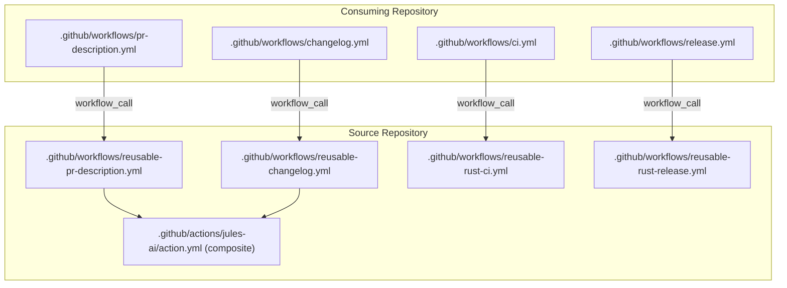

# Reusable GitHub Workflows

This directory contains reusable workflows that can be called from other repositories as thin shims.

## Available Workflows

| Workflow       | File                          | Purpose                                                  |
| -------------- | ----------------------------- | -------------------------------------------------------- |
| PR Description | `reusable-pr-description.yml` | Auto-generates PR titles and descriptions using Jules AI |
| Changelog      | `reusable-changelog.yml`      | Auto-generates changelog entries and creates a PR        |
| Rust CI        | `reusable-rust-ci.yml`        | Shared Rust CI checks, docs, and optional target builds  |
| Rust Release   | `reusable-rust-release.yml`   | Shared Rust release validation, packaging, release, and crates publish |

## Quick Start

### 1. PR Description Generator

Add this to your consuming repo at `.github/workflows/pr-description.yml`:

```yaml
name: Update PR Description

on:
  pull_request:
    types: [opened, edited]

jobs:
  update-pr:
    permissions:
      contents: read
    uses: weekendsuperhero-io/platform-tools/.github/workflows/reusable-pr-description.yml@main
    with:
      trigger-phrase: "@agent pr-title" # optional — only runs if this phrase is in the PR body
    secrets: inherit
```

**How it works:**

- When a PR is opened/edited with `@agent pr-title` in the body, the workflow:
  1. Diffs the PR against its base branch
  2. Sends the diff + commit messages to Jules AI
  3. Updates the PR with a structured title and description
- If the PR body doesn't contain the trigger phrase, the workflow skips

### 2. Changelog Generator

Add this to your consuming repo at `.github/workflows/changelog.yml`:

```yaml
name: Update Changelog

on:
  workflow_dispatch: # manual trigger
  # schedule:
  #   - cron: "0 0 * * 1"  # every Monday (optional)

jobs:
  changelog:
    permissions:
      contents: write
    uses: <owner>/<repo>/.github/workflows/reusable-changelog.yml@main
    with:
      changelog-path: CHANGELOG.md
      pr-branch-prefix: "chore/changelog-"
    secrets: inherit
```

**How it works:**

- Finds the last commit that touched `CHANGELOG.md`
- Collects all commits since then
- Sends full commit messages (subject + body) to Jules AI to generate changelog entries
- Inserts entries under `## [Unreleased]` (Keep a Changelog format)
- Creates a PR with the updated changelog

### 3. Rust CI (Reusable)

Add this to your consuming repo at `.github/workflows/ci.yml`:

```yaml
name: CI

on:
  push:
    branches: [main]
  pull_request:
    branches: [main]

jobs:
  ci:
    uses: weekendsuperhero-io/platform-tools/.github/workflows/reusable-rust-ci.yml@main
    with:
      check-os-json: '["ubuntu-latest","macos-latest","windows-latest"]'
      rust-cache-provider: github
      docs-os: ubuntu-latest
      linux-packages: "libdbus-1-dev pkg-config"
      build-matrix-json: "[]"
```

`eventkit-rs` style target builds in CI:

```yaml
jobs:
  ci:
    uses: weekendsuperhero-io/platform-tools/.github/workflows/reusable-rust-ci.yml@main
    with:
      check-os-json: '["macos-latest"]'
      rust-cache-provider: warpbuild
      docs-os: macos-latest
      build-matrix-json: >-
        [
          {"os":"macos-latest","target":"x86_64-apple-darwin","cargo_args":"--release"},
          {"os":"macos-latest","target":"aarch64-apple-darwin","cargo_args":"--release"}
        ]
```

### 4. Rust Release (Reusable)

Add this to your consuming repo at `.github/workflows/release.yml`:

```yaml
name: Release

on:
  push:
    tags:
      - "v*"

jobs:
  release:
    uses: weekendsuperhero-io/platform-tools/.github/workflows/reusable-rust-release.yml@main
    with:
      validate-runs-on: ubuntu-latest
      rust-cache-provider: github
      validate-linux-packages: "libdbus-1-dev pkg-config"
      # Optional override if binary cannot be inferred from Cargo.toml
      # binary-name: agentmail
      binary-matrix-json: >-
        [
          {"name":"linux-x86_64","os":"ubuntu-latest","target":"x86_64-unknown-linux-gnu"},
          {"name":"linux-aarch64","os":"ubuntu-24.04-arm","target":"aarch64-unknown-linux-gnu"},
          {"name":"macos-x86_64","os":"macos-latest","target":"x86_64-apple-darwin"},
          {"name":"macos-aarch64","os":"macos-latest","target":"aarch64-apple-darwin"},
          {"name":"windows-x86_64","os":"windows-latest","target":"x86_64-pc-windows-msvc"}
        ]
      enable-macos-universal: true
      # Optional overrides if your artifact names differ:
      # macos-universal-arm64-artifact: macos-aarch64
      # macos-universal-x86_64-artifact: macos-x86_64
      publish-crates-io: true
      cargo-publish-command: cargo publish -p agentmail
    secrets: inherit
```

## Configuration Options

### PR Description Workflow

| Input                   | Default                                            | Description                                        |
| ----------------------- | -------------------------------------------------- | -------------------------------------------------- |
| `trigger-phrase`        | `@agent pr-title`                                  | Phrase required in PR body to trigger the workflow |
| `base-branch`           | _(auto-detect)_                                    | Branch to diff against                             |
| `diff-file-patterns`    | `*.rs *.ts *.tsx *.toml *.sql *.yml *.sh *.css`    | File patterns to include in diff                   |
| `diff-exclude-patterns` | `:!pnpm-lock.yaml :!Cargo.lock :!**/bindings/*.ts` | Patterns to exclude                                |
| `max-diff-lines`        | `4000`                                             | Max lines of code diff to send                     |
| `max-commit-messages`   | `30`                                               | Max commit messages to include                     |
| `custom-prompt`         | _(built-in)_                                       | Override the Jules prompt entirely                 |

### Changelog Workflow

| Input                   | Default                     | Description                                      |
| ----------------------- | --------------------------- | ------------------------------------------------ |
| `changelog-path`        | `CHANGELOG.md`              | Path to your changelog file                      |
| `pr-branch-prefix`      | `chore/update-changelog`    | Prefix for the generated PR branch               |
| `max-commit-messages`   | `50`                        | Max full commit messages (subject + body) to include |
| `diff-file-patterns`    | _(legacy)_                  | Deprecated and ignored (kept for compatibility)  |
| `diff-exclude-patterns` | _(legacy)_                  | Deprecated and ignored (kept for compatibility)  |
| `max-diff-lines`        | `4000`                      | Deprecated and ignored (kept for compatibility)  |
| `fallback-commit-count` | `20`                        | Commits to use when no previous changelog entry  |
| `unreleased-heading`    | `## [Unreleased]`           | The heading to insert entries under              |
| `custom-prompt`         | _(built-in)_                | Override the Jules prompt                        |
| `pr-title`              | `docs: update CHANGELOG.md` | Title for the generated PR                       |
| `pr-body-template`      | _(auto)_                    | Body template (`{0}` is interpolated)            |

### Rust CI Workflow

| Input                             | Default                                      | Description                                              |
| --------------------------------- | -------------------------------------------- | -------------------------------------------------------- |
| `rust-toolchain`                  | `stable`                                     | Rust version/toolchain                                   |
| `rust-cache-provider`             | `github`                                     | Rust cache backend provider (`github` or `warpbuild`)    |
| `check-os-json`                   | `["ubuntu-latest"]`                          | Runner matrix for fmt/clippy/build/test                  |
| `docs-os`                         | `ubuntu-latest`                              | Runner for docs job                                      |
| `linux-packages`                  | _(empty)_                                    | Linux apt packages installed where needed                |
| `fmt-command`                     | `cargo fmt --all -- --check`                | Format check command                                     |
| `clippy-command`                  | `cargo clippy --all-targets --all-features -- -D warnings` | Clippy command                               |
| `build-command`                   | `cargo build --all-features`                | Build command                                            |
| `test-command`                    | `cargo test --all-features`                 | Test command                                             |
| `run-docs`                        | `true`                                       | Enable docs job                                          |
| `docs-command`                    | `cargo doc --no-deps --all-features`        | Docs command (`RUSTDOCFLAGS=-D warnings` is applied)     |
| `build-matrix-json`               | `[]`                                         | Optional target build matrix (JSON array)                |
| `build-matrix-default-cargo-args` | `--release`                                  | Fallback cargo args for build matrix entries             |

### Rust Release Workflow

| Input                               | Default                     | Description                                                |
| ----------------------------------- | --------------------------- | ---------------------------------------------------------- |
| `manifest-path`                     | `Cargo.toml`                | Manifest path used to infer binary name                    |
| `binary-name`                       | _(auto)_                    | Optional explicit binary base name (without `.exe`)        |
| `validate-runs-on`                  | `ubuntu-latest`             | Runner for release validation                              |
| `rust-cache-provider`               | `github`                   | Rust cache backend provider (`github` or `warpbuild`)      |
| `validate-linux-packages`           | _(empty)_                   | Linux apt packages for validation                          |
| `binary-matrix-json`                | `[]`                        | Release matrix (required per item: `os`, `target`; optional: `name`, `binary`, `archive`, `cargo_args`) |
| `build-linux-packages`              | _(empty)_                   | Linux apt packages for binary build jobs                   |
| `build-matrix-default-cargo-args`   | `--release`                 | Fallback cargo args for matrix entries                     |
| `enable-macos-universal`            | `false`                     | Build universal macOS binary with `lipo`                  |
| `macos-universal-binary`            | _(auto)_                    | Optional override for universal binary name               |
| `macos-universal-arm64-artifact`    | `macos-aarch64`             | Artifact name containing arm64 archive                    |
| `macos-universal-arm64-archive`     | _(auto)_                    | Optional arm64 archive override (`<binary>-<artifact>.tar.gz`) |
| `macos-universal-x86_64-artifact`   | `macos-x86_64`              | Artifact name containing x86_64 archive                   |
| `macos-universal-x86_64-archive`    | _(auto)_                    | Optional x86_64 archive override (`<binary>-<artifact>.tar.gz`) |
| `macos-universal-output-archive`    | _(auto)_                    | Optional universal archive override (`<binary>-macos-universal.tar.gz`) |
| `create-github-release`             | `true`                      | Publish GitHub release from uploaded artifacts             |
| `release-assets-glob`               | _(empty)_                   | Optional newline-separated filename globs                  |
| `publish-crates-io`                 | `false`                     | Publish to crates.io                                       |
| `cargo-publish-command`             | `cargo publish`             | Publish command override                                   |
| `release-name`                      | _(empty)_                   | Optional release title override                            |
| `generate-release-notes`            | `true`                      | Enable generated GitHub release notes                      |
| `release-draft`                     | `false`                     | Create draft release                                       |
| `release-prerelease`                | `false`                     | Mark release as prerelease                                 |

`create-github-release` uses a GitHub App token when `JULES_PR_CLIENT_ID` and `JULES_PR_PRIVATE_KEY` are provided; otherwise it falls back to `github.token`.

## Required Secrets

Jules workflows require:

| Secret          | Required | Description                                             |
| --------------- | -------- | ------------------------------------------------------- |
| `JULES_API_KEY` | Yes      | API key for Jules AI                                    |
| `JULES_PR_CLIENT_ID` | Optional | GitHub App ID / client ID for Jules PR automation |
| `JULES_PR_PRIVATE_KEY` | Optional | GitHub App private key PEM (must be set with `JULES_PR_CLIENT_ID`) |

Add `JULES_API_KEY` to your repo's **Settings → Secrets and variables → Actions**.

Rust release workflow requires:

| Secret                  | Required | Description                                            |
| ----------------------- | -------- | ------------------------------------------------------ |
| `CARGO_REGISTRY_TOKEN`  | Only when `publish-crates-io=true` | crates.io API token for `cargo publish` |
| `JULES_PR_CLIENT_ID`    | Optional | GitHub App ID/client ID used for GitHub release writes |
| `JULES_PR_PRIVATE_KEY`  | Optional | GitHub App private key PEM paired with `JULES_PR_CLIENT_ID` |

Caller workflows can either pass named secrets explicitly (`secrets: { ... }`) or use `secrets: inherit`.
`secrets: inherit` is set in the caller job that uses the reusable workflow and is supported for repositories in the same organization or enterprise.
`GITHUB_TOKEN` is automatically available to workflows via `github.token`; no explicit secret declaration is required in the reusable workflow.
For GitHub App auth, workflows use `JULES_PR_CLIENT_ID` + `JULES_PR_PRIVATE_KEY`.
Client secret alone is not sufficient; you need the app private key.
GitHub App permissions for PR description/changelog automation: `Pull requests: Read and write`; add `Contents: Read and write` when creating commit branches/PRs (for changelog), and at least `Contents: Read` for checkout operations with app token.
When GitHub App auth is used in changelog workflow, commits are authored/committed as `<app-slug>[bot] <id+app-slug[bot]@users.noreply.github.com>`.
Permissions are separate from secrets: set explicit `permissions` in both caller and reusable workflows for least privilege.
These reusable workflows intentionally do not request `pull-requests: write` for `GITHUB_TOKEN`; PR updates should run through the configured GitHub App token.

## Architecture



## Troubleshooting

**Workflow doesn't trigger:**

- For PR description: ensure the trigger phrase appears in the PR body
- For changelog: ensure you're triggering `workflow_dispatch` or the schedule

**Jules returns plain text instead of JSON (PR workflow):**

- The workflow falls back to using the raw text as the description — this is expected

**"No output from Jules" error:**

- Check that `JULES_API_KEY` is set correctly
- Check Jules API status / rate limits

**Changelog entries appear in wrong place:**

- Ensure your changelog has the exact `## [Unreleased]` heading (or configure `unreleased-heading`)
